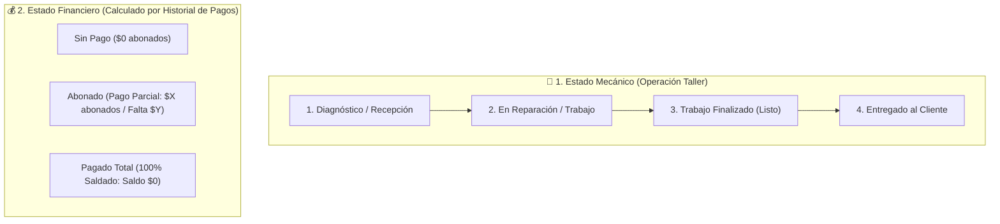

# 📊 Planificación Financiera y Recaudación T-MIM

Este documento define la arquitectura técnica, modelo de datos, flujo de estados y diseño de interfaces para el nuevo módulo de **Finanzas, Recaudación Centralizada (Flow / Presencial), Abonos y Liquidaciones** en **T-MIM**.

---

## 1. Visión General del Modelo de Negocio

T-MIM opera como software de gestión de talleres y **plataforma recaudadora centralizada**:
* **Cobros Presenciales (Caja / POS propio del taller):** **0% Comisión** para T-MIM. El 100% del dinero queda en el taller.
* **Cobros Online (Link de Pago Flow):** T-MIM recauda de forma centralizada y descuenta la comisión correspondiente:
  $$\text{Comisión Total} = \text{Tarifa Pasarela Flow} + (\text{Comisión T-MIM} + \text{IVA Comisión T-MIM})$$
* **Liquidaciones Quincenales:** T-MIM transfiere a la cuenta bancaria de cada taller el monto neto acumulado vía Flow cada 15 días con respaldo de comprobante bancario.

---

## 2. Los Dos Ejes de Control (Mecánico vs Financiero)

Para evitar confusiones, cada trabajo en el taller cuenta con un **ID Único de Reparación (OT)** y se controla mediante dos estados independientes:

### Reglas de Transición Automática:
1. **Ingreso:** El vehículo entra en `Diagnóstico` y `Sin Pago`.
2. **Registro de Abono:** Cuando el cliente deja un anticipo (para repuestos o mano de obra), se crea un registro en la tabla `Historial de Pagos`. El estado financiero pasa automáticamente a **`Abonado`**.
3. **Botón [Finalizar Trabajo]:**
   * El estado mecánico cambia a **`Trabajo Finalizado`**.
   * El sistema calcula en tiempo real:
     $$\text{Saldo Pendiente} = (\text{Mano de Obra} + \text{Repuestos de Bodega} - \text{Descuentos}) - \sum(\text{Abonos})$$
   * Si el saldo es $\$0 \rightarrow$ Estado: **`Pagado Total`**.
   * Si el saldo es $> \$0 \rightarrow$ Estado: **`Abonado (Pendiente Saldo)`** o **`Sin Pago`**.
4. **Entrega:** Se recomienda el cambio a **`Entregado`** una vez que el estado financiero esté en **`Pagado Total`**.

---

## 3. Modelo de Datos y Estructura de Tablas

### A. Órdenes de Cobro / Trabajo (`payment_orders` / `service_orders`)
* `id` (UUID - ID Único de Reparación)
* `account_id` (Multi-tenant)
* `logbook_record_id` (Vínculo con la Bitácora / OT técnica)
* `client_id` (Cliente)
* `asset_id` (Vehículo / Patente)
* `mechanical_status`: Enum (`diagnosis`, `in_progress`, `completed`, `delivered`)
* `labor_amount`: Decimal (Mano de obra)
* `parts_amount`: Decimal (Total repuestos calculados desde Bodega)
* `discount_amount`: Decimal (Descuentos comerciales en pesos)
* `total_amount`: Decimal (`labor_amount + parts_amount - discount_amount`)
* `notes`: Text

### B. Historial de Abonos y Pagos (`payments` / `payment_installments`)
* `id` (UUID)
* `account_id` (Multi-tenant)
* `payment_order_id` (FK a la Orden de Reparación)
* `amount`: Decimal (Monto abonado)
* `payment_channel`: Enum (`cash`, `pos_local`, `transfer_local`, `flow_online`)
* `flow_order_id`: String (Identificador de transacción Flow)
* `flow_fee`: Decimal (Costo pasarela)
* `platform_fee`: Decimal (Comisión T-MIM + IVA)
* `net_amount`: Decimal (Monto líquido taller)
* `recorded_at`: Datetime
* `notes`: String (ej. "Abono inicial 50% repuestos")

---

## 4. Pantalla "Finanzas" (Lado Taller / Empresa)

### A. Las 3 Tarjetas Superiores (KPIs)
1. 💳 **Card 1: Ventas Totales:** Total bruto facturado en el mes (Presencial + Flow).
2. 🏷️ **Card 2: Comisiones Retenidas:** Total descontado por pasarela y plataforma (solo sobre ventas Flow).
3. 💰 **Card 3: Neto por Recibir:** Saldo líquido en Flow que T-MIM transferirá en la próxima liquidación quincenal.

### B. Barra de Filtros y Acciones
* **Filtros rápidos:** `[ Todos ]` `[ 🌐 Solo Flow ]` `[ 🏢 Solo Presenciales ]`
* **Filtros por estado financiero:** `[ Todos ]` `[ Pagado Total ]` `[ Abonado ]` `[ Sin Pago ]`
* **Botón de Acción:** `[ + Nueva Venta Presencial ]`

### C. Dashboard / Grid de Transacciones
Columnas principales del listado:
1. **N° OT / Folio** (ID Único de Reparación).
2. **Fecha y Hora.**
3. **Vehículo y Cliente** (Patente, Modelo, Nombre y WhatsApp).
4. **Estado Mecánico** (Badge: Diagnóstico / En Reparación / Finalizado / Entregado).
5. **Mano de Obra ($).**
6. **Repuestos ($) [Interactivo]:** Muestra el monto total. Al hacer **clic / doble clic**, abre un modal con el desglose de piezas, cantidades y precios unitarios.
7. **Descuento ($).**
8. **Total ($) y Saldo Restante ($).**
9. **Estado Financiero** (Badge: Pagado Total / Abonado / Sin Pago).
10. **Acciones:**
    * 👁️ **Ver Detalles:** Ficha completa de la reparación, repuestos e historial de abonos.
    * ✏️ **Editar:** Ajustar mano de obra, repuestos o descuentos.
    * 🔗 **Link de Pago:** Generar y compartir link Flow por WhatsApp con el saldo restante.
    * 📄 **PDF:** Generar e imprimir la Orden de Servicio y Comprobante de Pago/Entrega.

---

## 5. Módulo Superadmin (Matriz Recaudadora - Fase Posterior)

* **Billetera Central Flow:** Monitoreo global de los fondos ingresados por pasarela.
* **Liquidaciones Quincenales (Payouts):**
  * Corte automático cada 15 días por cada cuenta/taller.
  * Cálculo: $\text{Recaudado Flow} - \text{Comisiones} = \text{Monto Neto a Transferir}$.
  * Registro de transferencia y subida de comprobante bancario para visualización del taller.
